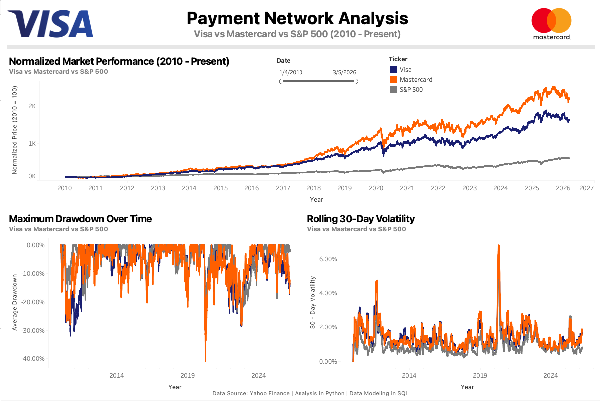
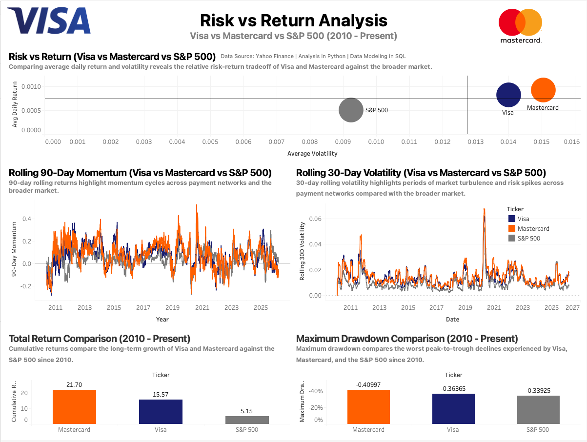
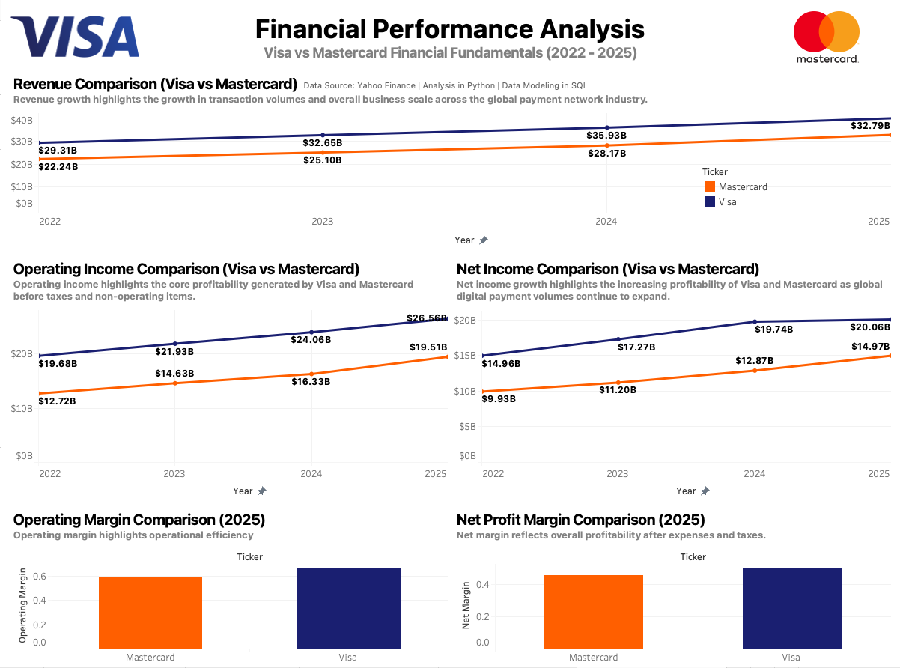

# PaymentRails

## Visa and Mastercard: Market & Competitive Analysis

Market and competitive analysis of global payment networks, focusing on Visa and Mastercard. Using public financial and market data, this project explores differences in market performance, scale, growth, and profitability through an end-to-end analytics workflow and interactive BI dashboards.

---

## Table of Contents
- [Status](#status)
- [Overview](#overview)
- [Analytical Objectives](#analytical-objectives)
- [Market Context](#market-context)
- [Data Sources](#data-sources)
- [Methodology](#methodology)
- [Tools & Technologies](#tools--technologies)
- [Core Analytical Dimensions](#core-analytical-dimensions)
- [Dashboards](#dashboards)
- [Visualization Approach](#visualization-approach)
- [Project Structure](#project-structure)
- [How to Run](#how-to-run)
- [Key Insights](#key-insights)
- [Notes & Limitations](#notes--limitations)

---

## Status

**Completed**

The full data pipeline, analytics layer, and visualization components have been implemented.

Python scripts ingest market and financial data, MySQL computes market analytics metrics such as daily returns and rolling volatility, and BI-ready datasets are exported for visualization in Tableau and Excel.

---

## Overview

PaymentRails is a market analytics project that examines how large-scale payment networks compete within the global financial ecosystem. Rather than focusing on consumer-facing payment products, the project frames Visa and Mastercard as financial infrastructure providers, emphasizing transaction scale, revenue efficiency, and margin durability.

Using publicly available market and financial data, the project compares how these networks differ across market performance, growth characteristics, and profitability.

---

## Analytical Objectives

- Compare the long-term market performance of Visa and Mastercard  
- Analyze differences in scale, revenue growth, and profitability  
- Examine tradeoffs between growth, stability, and margin durability  
- Identify structural similarities and differences between payment network models  
- Replicate a realistic market analysis workflow using public data  

---

## Market Context

Payment networks operate as transaction infrastructure connecting issuing banks, merchants, and consumers. These networks benefit from strong network effects, asset-light operating models, and global scale.

Visa and Mastercard represent two of the largest and most established players in this space, making them a natural comparison set for studying how scale, efficiency, and growth interact in mature fintech markets.

---

## Data Sources

- Historical stock price data from Yahoo Finance  
- Financial statement data from public company filings  
- Aggregated financial datasets summarizing revenue and margins  
- Annual reports and investor materials for the business context  

---

## Methodology

- Pull raw market and financial data using Python.
- Clean and normalize datasets using SQL transformations.
- Compute derived metrics such as daily returns and rolling volatility using SQL window functions. Python is used for ingestion and exporting BI-ready datasets.
- Export analysis-ready tables for Tableau Public. 

---

## Tools & Technologies

- Python
- MySQL
- SQL
- pandas
- Excel / Power Query
- Tableau Public
- Git & GitHub

---

## Core Analytical Dimensions

### Market Performance
- Indexed stock price trends  
- Relative returns and volatility  

### Scale & Transaction Activity
- Reported payment volume as a proxy for network scale  
- Growth trends in transaction activity  

### Revenue & Monetization
- Revenue growth over time  
- Monetization efficiency indicators  

### Profitability
- Gross and operating margin trends  
- Margin stability across cycles  

---

## Dashboards

### 1. Payment Network Market Analysis
• The published Tableau dashboard can be found [here](https://public.tableau.com/app/profile/nathan.ho2158/viz/PaymentNetworkMarketAnalysis/PaymentNetworkAnalysis)



This dashboard provides a high-level comparison of Visa and Mastercard across market performance and financial metrics. The goal is to highlight differences in growth, scale, and long-term market behavior between the two payment networks.

---

### 2. Risk vs Return Analysis
• The published Tableau dashboard can be found [here](http://public.tableau.com/app/profile/nathan.ho2158/viz/RiskVsReturnAnalysis/RiskvsReturnAnalysis)



This dashboard focuses on risk-return characteristics of Visa and Mastercard relative to the broader market. Using derived metrics such as daily returns and volatility, it visualizes how the two companies compare in terms of performance stability and market risk.

---

### 3. Financial Performance Analysis
• The published Tableau dashboard can be found [here](https://public.tableau.com/app/profile/nathan.ho2158/viz/FinancialPerformanceAnalysis_17726872075600/FinancialPerformanceAnalysis)



This dashboard explores company fundamentals including revenue growth, profitability, and margin performance. The analysis highlights how the operating economics of Visa and Mastercard differ despite their similar positions within the payment network ecosystem.

---

## Visualization Approach

Dashboards are built using Tableau Public and Excel to support exploratory financial analysis. The visualizations emphasize comparative analysis across market performance, scale, and profitability while maintaining a clear analytical narrative.

---

## Project Structure

```
PaymentRails/
├── src/
│   ├── __init__.py
│   ├── stock_load.py
│   ├── financial_load.py
│   ├── data_transformation.py
│   ├── metrics_build.py
│   └── tableau_export.py
│
├── data/
│   ├── raw/
│   │   └── market_prices.csv
│   └── analytics/
│       ├── market_metrics.csv
│       ├── summary_metrics.csv
│       └── financials.csv
│
├── sql/
│   ├── analytics/
│   │   ├── daily_returns.sql
│   │   ├── volatility.sql
│   │   └── market_metrics.sql
│   └── schema/
│       ├── raw_market_prices.sql
│       └── clean_market_prices.sql
│
├── dashboards/
│   ├── PaymentNetworkAnalysis.png
│   ├── RiskVsReturnAnalysis.png
│   └── FinancialPerformanceAnalysis.png
│
├── excel/
│   └── MarketAnalytics.xlsx
│
└── README.md

```
## How to Run

1. **Pull historical market data**

Run the ingestion script to download historical stock price data for Visa, Mastercard, and the S&P 500.

```
python src/stock_load.py
```

This script saves the raw dataset to:

```
data/raw/market_prices.csv
```

---

2. **Load financial fundamentals**

Run the financial ingestion script to build the fundamentals dataset used in the analysis.

```
python src/financial_load.py
```

This generates the financial dataset used for revenue, profitability, and margin analysis.

---

3. **Transform and clean the datasets**

Run the transformation script to normalize and prepare the datasets for analytics processing.

```
python src/data_transformation.py
```

---

4. **Build analytics metrics**

Generate derived metrics used in the dashboards and analysis.

```
python src/metrics_build.py
```

This step calculates metrics such as:

- Daily returns  
- Volatility  
- Summary market metrics  

---

5. **Run SQL analytics layer**

Execute the SQL scripts to create the cleaned market tables and analytics metrics.

```
sql/schema/raw_market_prices.sql
sql/schema/clean_market_prices.sql
sql/analytics/daily_returns.sql
sql/analytics/volatility.sql
sql/analytics/market_metrics.sql
```

These scripts compute the core analytics metrics used to compare Visa, Mastercard, and the S&P 500 across performance, volatility, and drawdown characteristics.

---

6. **Export BI-ready datasets**

Export the analytics tables for visualization.

```
python src/tableau_export.py
```

This generates CSV files in:

```
data/analytics/
```

---

7. **Open visualization and analysis files**

The exported datasets are used in:

- **Tableau Public dashboards** for visualization  
- **Excel workbook (`excel/MarketAnalytics.xlsx`)** for additional exploratory financial analysis

---

## Key Insights

Initial analysis highlights several structural similarities between Visa and Mastercard:

- Both payment networks have significantly outperformed the broader market over long horizons.
- Mastercard exhibits slightly higher volatility and deeper historical drawdowns.
- Visa shows a marginally more stable risk profile while maintaining comparable growth.
- Both firms benefit from scalable, asset-light business models driven by strong network effects.

These patterns reinforce the durability of global payment infrastructure as a long-term business model.
---

## Notes & Limitations

This project uses publicly available financial and market data and focuses on descriptive comparative analysis rather than forecasting or investment recommendations.

The project also reflects a transition in my Python coding style from CamelCase to snake_case for functions, variables, and filenames to better align with Python development conventions.
